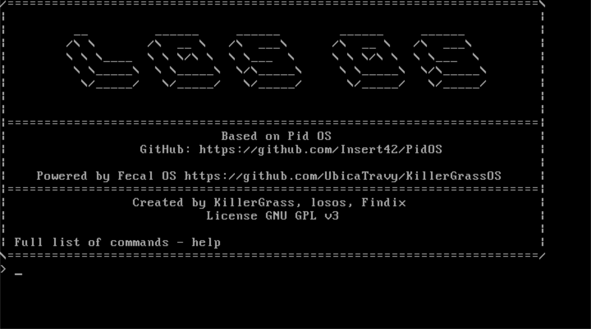
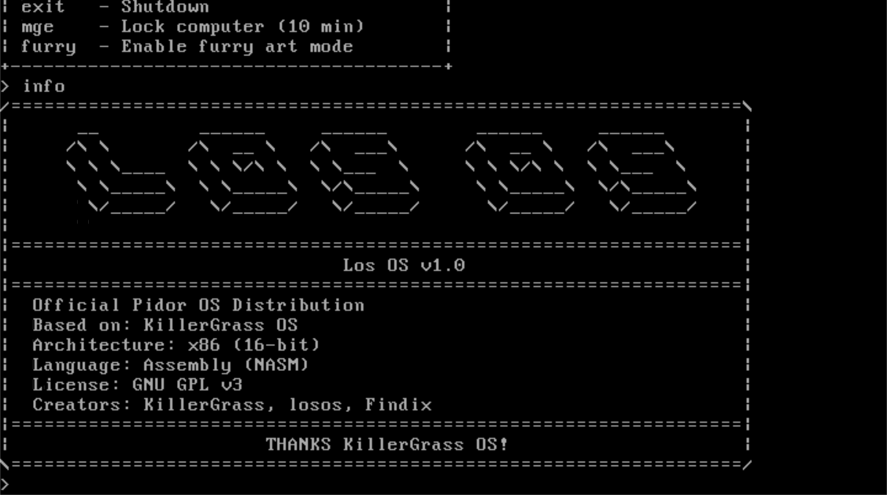

# Los OS
<a href="https://github.com/insert42/PidorOS/blob/main/LICENSE">
  
</a>
<a href="https://github.com/UbicaTravy/KillerGrassOS/releases/tag/v0.0001">
  
</a>
<a href="https://github.com/insert42/PidorOS">
  
</a>


[KillerGrass](https://t.me/kanal_kashkamalhika), [losos](https://t.me/furrylosos), [Findix](https://t.me/shizaFindika)

<p align="center">
  
</p>

## Описание

**LosOS** - это дистрибутив Pid OS, созданный на основе [KillerGrass OS версии 0.0001](https://github.com/UbicaTravy/KillerGrassOS/releases/tag/v0.0001). Операционная система представляет собой юмористический смысл.

Последняя версия: 1.0

[](DOCUMENTATION.md)

## Технические характеристики

- **Архитектура**: x86 (16-bit)
- **Язык**: Assembly (NASM)
- **Загрузчик**: от [KillerGrass](https://github.com/UbicaTravy/KillerGrassOS) v0.0001
- **Размер**: 16KB
- **Основа**: [Pid OS](https://github.com/Insert42/PidOS)

## Доступные команды

### Системные команды
```
help   - Показать справку по командам
clear  - Очистить экран
info   - Информация о системе
mem    - Информация о памяти
time   - Показать текущее время
date   - Показать текущую дату
ver    - Показать версию ОС
test   - Тестовая команда
```

### Информационные команды
```
cpu    - Информация о процессоре
disk   - Информация о диске
bios   - Информация о BIOS
```

### Утилиты
```
calc   - Простой калькулятор
kg     - Текстовый редактор KillerGrass
```

### Игры
```
paint  - Текстовый редактор рисования
guess  - Игра "Угадай число" (1-10)
```

### Управление системой
```
reboot - Перезагрузить систему
exit   - Выключить систему
```

### Развлекательные команды
```
mge    - Получить бесплатные робуксы
furry  - Показать фурри
pornogayfurry - Загрузка контента 18+ с фурри
```

## Сборка и запуск

### Требования
- NASM (Netwide Assembler)
- QEMU для эмуляции

### Сборка
```bash
build.bat
```

### Запуск
```bash
run.bat
```

# Скриншоты




## Особенности

- **Модульная архитектура**: команды подключаются как отдельные модули
- **Система выполнения команд**: команды могут вызывать другие команды
- **Защита стека**: автоматическая проверка целостности стека
- **Унифицированный интерфейс**: все программы используют единые клавиши управления
- **Текстовый редактор и простая программа для рисования**: довольно сильно для ОС на 16 битном ассемблере

## Авторы

- **KillerGrass** - Создатель [KillerGrass OS](https://github.com/UbicaTravy/KillerGrassOS), программист
- **losos** - Автор идей Otsos OS
- **Findix** - абаюдно

## Лицензия

[](LICENSE)

## Ссылки

- База на [KillerGrass OS](https://github.com/UbicaTravy/KillerGrassOS)
- Основано на: [Pid OS](https://github.com/Insert42/PidOS)

---

*Этот проект является пародией и создан исключительно в юмористических целях. Все совпадения с реальными операционными системами случайны. Otsos OS является официальным дистрибутивом [Pid OS](https://github.com/Insert42/PidOS).*

**Made in Russia!**